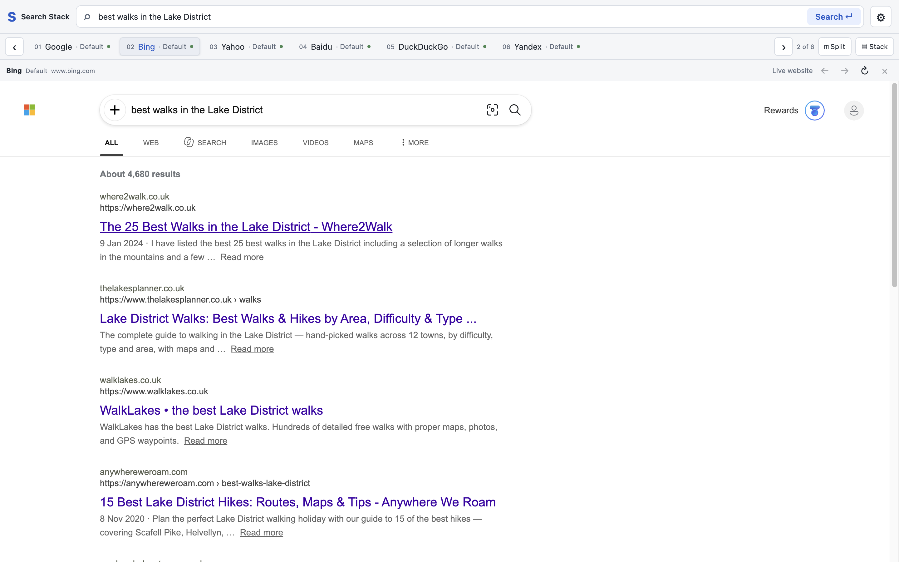
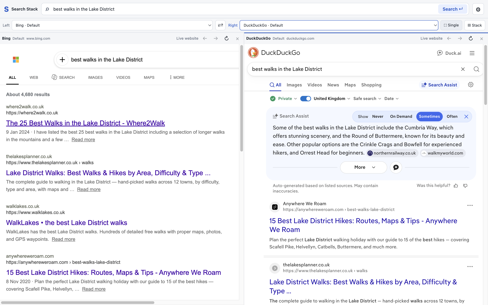
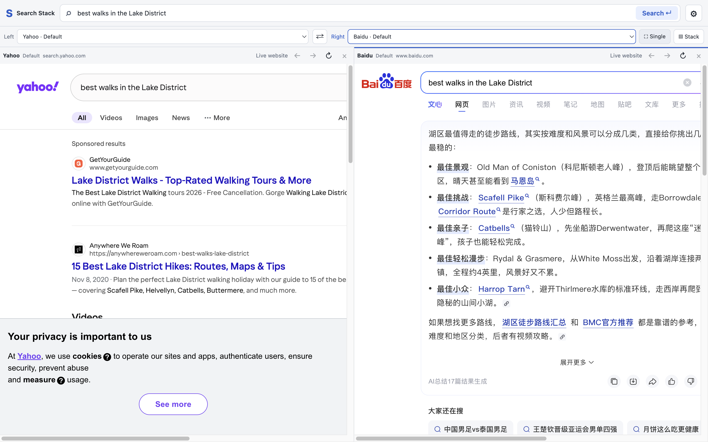
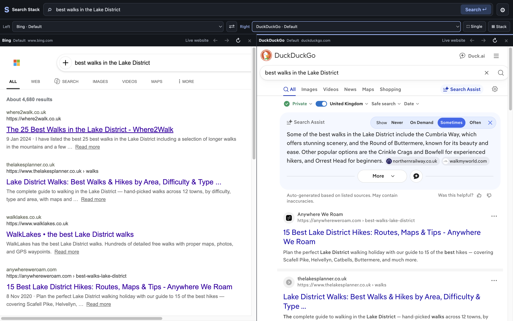

# Search Stack

**One query. More perspectives. Fewer tabs.**

A free, open-source desktop app for comparing search engines. Type once, see what
each engine finds, and put two results side by side. Your browser tabs can take a nap.

<p align="center">
  
</p>

Google, Bing, DuckDuckGo, Yahoo, Baidu, Yandex—or add your own. Pick an engine for
each side, swap them, or give one page the whole window. Each keeps its place.



Or compare two perspectives side by side. Same search, different trails.



<details>
<summary>More engines, and a theme for night owls</summary>

Yahoo and Baidu bring their own perspectives to the same Lake District search.



Prefer the lights low?



</details>

## Get it

**macOS 13+ · Apple silicon · Free preview**

```sh
brew install --cask nanomader/tap/search-stack
```

Or [download the Mac app](https://github.com/nanomader/search-stack/releases/tag/v0.1.0)
and drag it into Applications. No Node.js or developer tools needed.

**First launch:** this preview isn't Apple-notarized or Developer ID signed. If
macOS says it cannot verify Search Stack, click **Done**, then open **System
Settings → Privacy & Security → Open Anyway** for Search Stack and confirm
**Open**. See [Apple's instructions](https://support.apple.com/en-us/102445).
Intel, Windows, and Linux downloads aren't available yet.

## A little more room to explore

Click **Split** to compare two pages, **Single** to focus, or **Stack** to scroll
through your engines. **⌘L** starts another search. That's the main idea.

Prefer Day or Night? Want two separate Google profiles? Open **Settings**.
These are real websites, including their ads, sign-in restrictions, and occasional
CAPTCHAs. The hamster has no special powers over those.

## Make it better

Found a rough edge? [Tell us what happened](https://github.com/nanomader/search-stack/issues).
Ideas, small fixes, and screenshots are welcome. If it saves you a few tabs,
share it with a fellow curious person.

[Contribute](CONTRIBUTING.md) · [Run from source](docs/DEVELOPMENT.md) · [MIT license](LICENSE)

No Search Stack account, subscription, or app analytics. Queries go directly to
the selected search websites, whose own privacy policies apply.
